# Documentation for predicting tweets virality using ML

In this project we worked with a data set composed of tweets about data analysis, data science, and data visualization.
The main goal of this project was to analyse the data features and predict tweets virality.
For easy applicability, a console-based application for tweet classification is provided. This allows anyone to type a 
tweet into the console and have the model predict whether the tweet will become viral or not.

In the following documentation we provide specifics about the processes involved during the model implementation.

## Evaluation

### Design Decisions

Which evaluation metrics did you use and why? 

For the evaluation, three different Evaluation Matrices have been implemented. The implemented Evaluation Matrices are below. 

 - Accuracy

 - Log Loss

 - ROC and AUC 
 

### Accuracy: 

Accuracy Matrices tell us the proportion of the true results among the total number of cases examined. This is one of the easies 

matrices to understand and easily fits for multiclass classification problems as well as binary classifications.

As we know from our dataset of Tweets, it is indeed a well-balanced dataset with no skewed and no class imbalance, 
it makes sense to use accuracy to 

evaluate our model.

    Accuracy = (TP+TN)/(TP+FP+FN+TN)
    

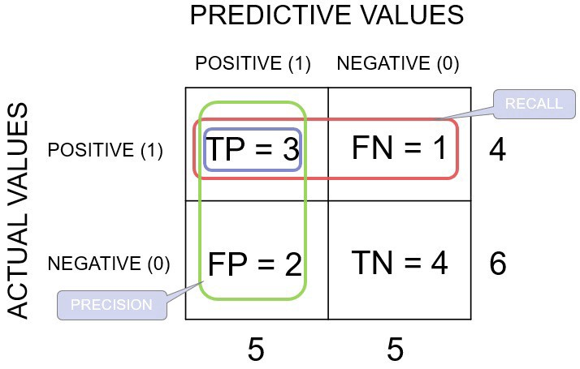

The Graph of accuracy can be interpreted as, as the model learns, the accuracy get higher if the model has been designed in an efficient way with appropriate and sufficient features.

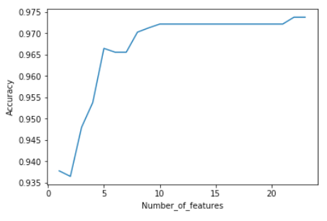

### Log Loss: 

Logarithmic Loss or Lof Loss classification works by eliminating the false classifications and works well with multiclass classification. Log Loss assigns a probability to each class for all the samples. 

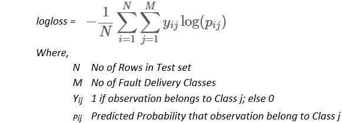

    y_ij, indicates whether sample i belongs to class j or not

    p_ij, indicates the probability of sample i belonging to class j

log loss has no upper bound, meaning can be from 0 to inf. log loss of zero means higher accuracy

where bigger value means lower accuracy.

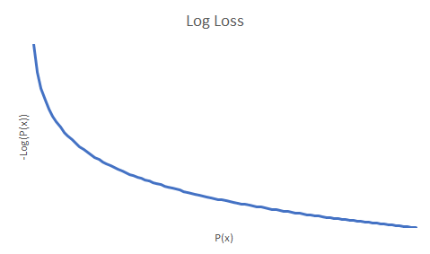

### ROC and AUC:

ROC(receiver operating characteristic ) curve is a graph showing the performance of a classification model at all classification 
thresholds. graph plots

True Positive on the y axis and False Positive on the x-axis. 

    True Positive Rate/Sensitivity: TPR = TP/(TP+FN)

    False Positive Rate/Specificity: FPR = FP/(FP+TN)

The ROC curve shows the trade-off between sensitivity (or TPR) and specificity (1 – FPR). In simple terms, it is the curve of probability. Classifiers that give curves closer to the top-left corner indicate better performance. As a baseline, a random classifier is expected to give points lying along the diagonal (FPR = TPR). The closer the curve comes to the 45-degree diagonal of the ROC space, the less accurate the test. ROC does not depend on the classification distribution. 

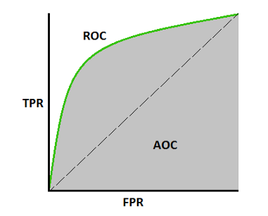

AUC(Area under the ROC curve) is useful for comparing different classifiers and summarizing the performance of each classifier into a single measure. The most common approach is to compute the area under the ROC curve. It is equivalent to the two-sample Wilcoxon rank-sum statistics. Higher the AUC, the better the model is at predicting 0 classes as 0 and 1 classes as 1. Depending upon the threshold, we can minimize or maximize them. When AUC is 0.7, it means there is a 70% chance that the model will be able to distinguish between positive class and negative class. The better the model is, it will generate a result close to 0.5, meaning, the model can differenciate true positive and true negative from the data set. 

From the below images, we can understand how the result can be interpreted. 

    For a well designed model the ROC and AUC plots should look similar to this.  

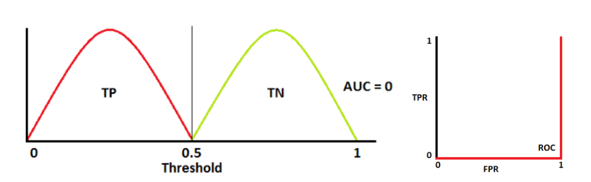

    From the below image, we can see that the model can only differentiate 70% of the true positive and true negatives. 
    Thats why the plots overlaps. 

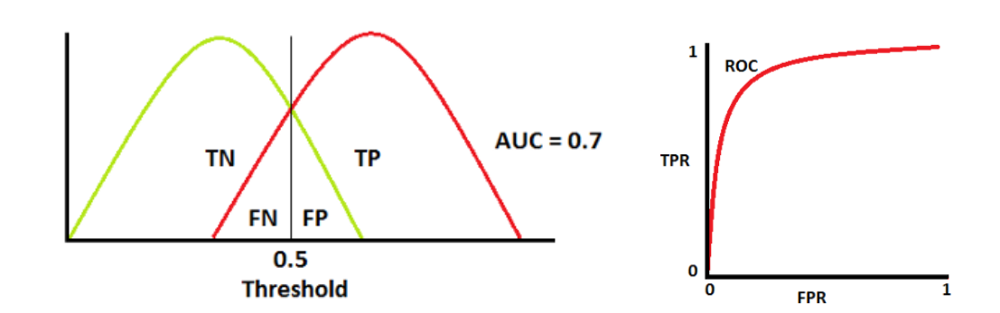

### Preprocessing 

Preprocessing of the data: 

steps: 

 - fill missing data

 - get rid of none fillable data

 - get rid of unuseful columns

 - tokenization

 - url removal

 - lemmatization

 - stop word removal

 - punctuation removal
 

### Fill in missing data: 

Dealing with missing data is very important in any part of data preprocessing. For this project, 
forward fill and backward fill has been used to 

make sure that, there are no NAN values and the other part of the data can be used for other features instead of 
getting rid of the whole data row. 

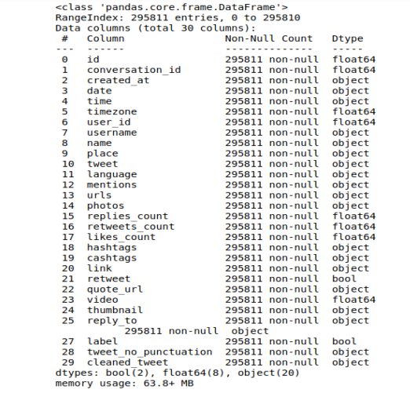

### Delete Columns: 

Some data are not possible to fill because of the nature of the data and non-usability. Such data columns
 have been removed. 

These columns have been removed:

    'user_rt', 'retweet_id', 'retweet_date', 'translate', 'trans_src', 'near', 'geo', 'source', 'user_rt_id'

### Tokenization: 

In order to get our computer to understand any text, we need to break that word down in a way that our 
machine can understand. That’s where the concept of tokenization 

Natural Language Processing (NLP) comes in. Simply put, we can’t work with text data if we don’t perform 
tokenization. It is the building block of Natural Language Processing.

For performing tokenization, first, the data has been converted into sentence tokens. Then, from those sentence
tokens, data has been processed into word tokens for further preprocessing. 

### URL removal: 

For natural language preprocessing, the URLs don't represent anything except noise to the data. For getting rid of
the extra noises, the URLs from the data has been removed for further preprocessing

Regular expressions are one of the most essential parts of the NLP. URLs are removed using regular expressions for 
making the process much faster. 

### Lemmatization:

For grammatical reasons, documents are going to use different forms of a word, such as organize, organize, 
and organize. Additionally, there are families of derivationally related words with similar meanings, 

such as democracy, democratic, and democratization. In many situations, it seems as if it would be useful 
to search for one of these words to return documents containing another word in the set. 

Lemmatization usually refers to doing things properly with the use of a vocabulary and morphological 
analysis of words, normally aiming to remove inflectional endings only and to return the base or dictionary form 
of a word, which is known as the lemma.

Stemming usually refers to a crude heuristic process that chops off the ends of words in the hope of 
achieving this goal correctly most of the time, and often includes the removal of derivational affixes.

Lemmatization has been used instead of stemming to keep the data meaningful and closer to its lexical meaning. 

### Stop Word Removal: 

Stop word removal is one of the most commonly used preprocessing steps across different NLP applications. 
The idea is simply removing the words that occur commonly across all the documents in the corpus.

Typically, articles and pronouns are generally classified as stop words. These words have no significance
in some of the NLP tasks like information retrieval and classification, which means these words are 
not very discriminative.

On the contrary, in some NLP applications stop word removal will have very little impact. Most of the time,
the stop word list for the given language is a well-hand-curated list of words that 
occur most commonly across corpora.

From the Nltk corpus, the English language library of stop words has been used to get rid of the most 
common words that have none or ignorable impacts. 

### punctuation removal: 

Punctuation words make the data uninterpretable when it's being tokenized and lemmatized. These steps have no 
meaning and means to be removed to keep the data clean, readable, and computationally efficient.

The work flow of the preprocessing is well defined with the diagram below: 

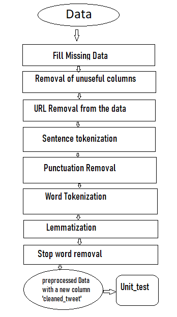

### Unit Test of the Data Set: 

After performing the pre processing steps, unit check has been performed to make sure our preprocessing steps in the pipeline are working as desired. 

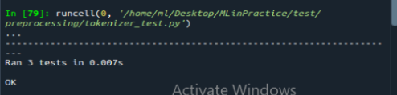

## Features Visualization
To reduce the computational complexity and focus all the resources in the most valuable and telling 
features, we decided to do some initial look into our `tweets` data to get an idea about how different 
features interact with each other and how they influence tweets virality. This way we could reduce the amount 
of less useful features we have and identify the most explanatory variables thus improving the interpretability 
of the model. Afterwards, we can select those features that are more relevant, and then use them
to train our model to predict tweets virality. 

### Design Decisions

Initially, we did some exploratory analysis of the data features as given by looking at the data description and 
variance.
- Initial data features description and variance

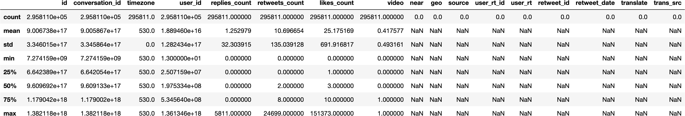

[comment]: <> (![df_description]&#40;images/description_data.png&#41;)

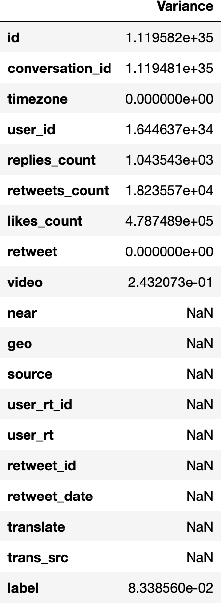

[comment]: <> (![df_variance]&#40;images/features_variance.png&#41;)

Afterwards we selected some features, created some others by counting the amount of `hashtags`, `urls`, `photos`, 
`videos` and the `hour` of tweets creation since we consider they could be useful to predict tweets' virality. 
Also, we dropped out those features with `NaN` values.

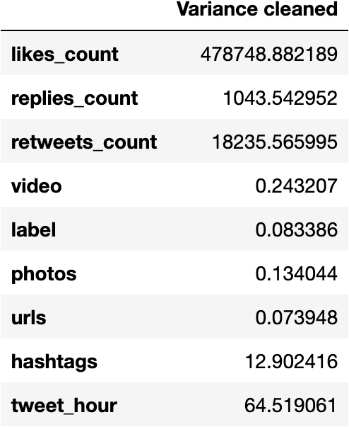

[comment]: <> (![df_description]&#40;images/features_variance_cleaned.png&#41;)

We also grouped the selected features by `label` (viral | non-viral) and calculated their means and variances.

  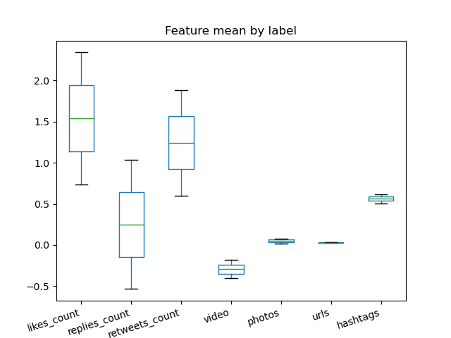
  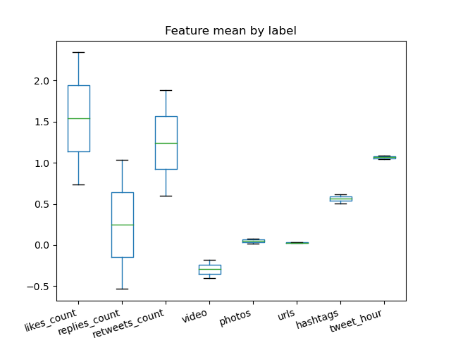
  
  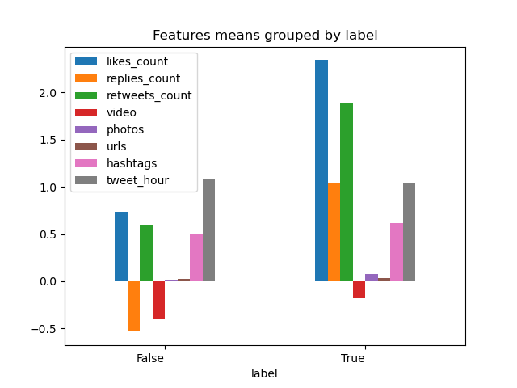

[comment]: <> (![df_description]&#40;images/features_means_by_label.png&#41;)
[comment]: <> (![df_description]&#40;images/features_variance_by_label.png&#41;)
[comment]: <> (![df_description]&#40;images/features_means_grouped_by_label.png&#41;)

Finally, we reinforced our feature selection process by calculating the correlations between the data features. In the
`feature_selection_by_correlation.png` we have the `heatmap` correlation for both the clean and uncleaned 
data which give us a better representation of the features' relationship.

  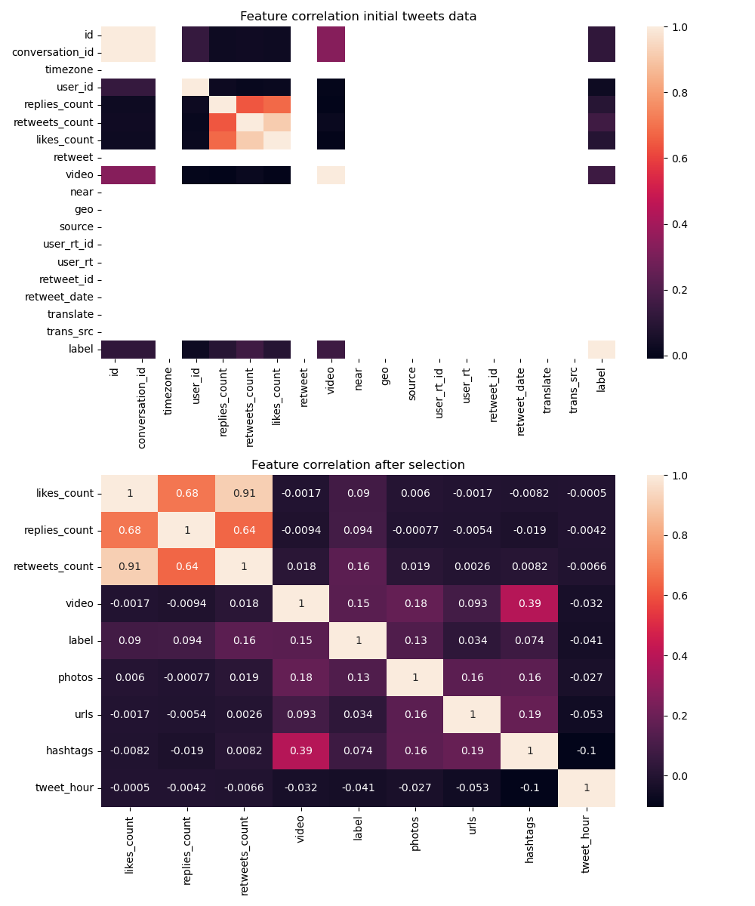
  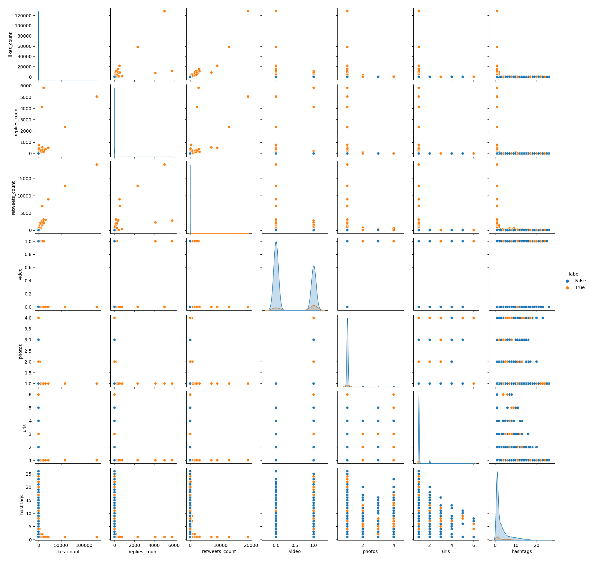
  

[comment]: <> (![df_description]&#40;images/feature_selection_by_correlation.png&#41;)

With the `df_clean` already grouped by label we proceed to explore tweets' virality by creating different scatterplots 
for all features. 

  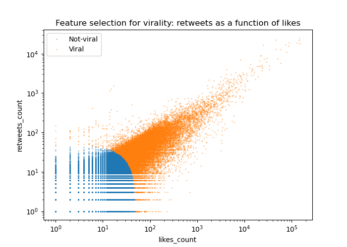
  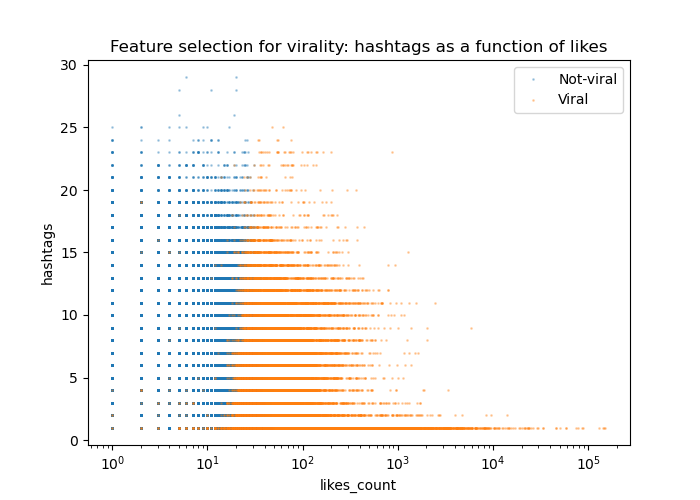
  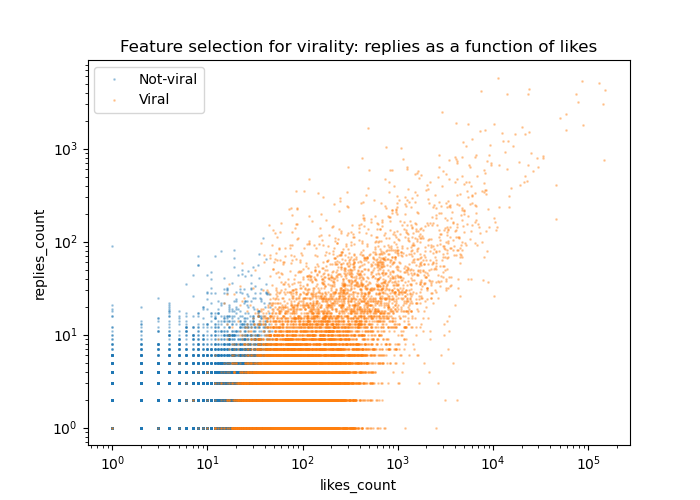
  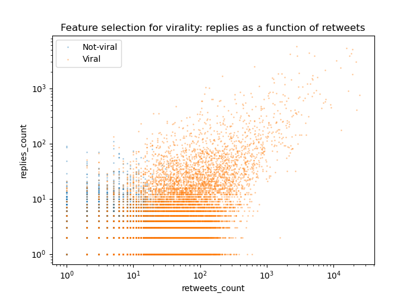

  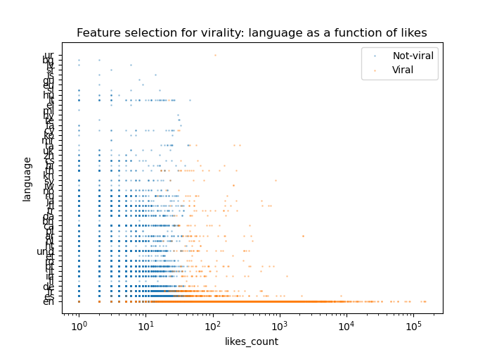
  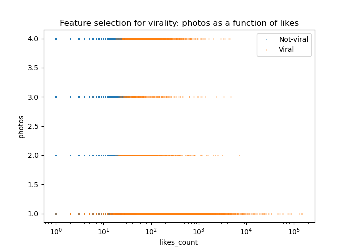

[comment]: <> (![df_description]&#40;images/retweets_likes.png&#41;)
[comment]: <> (![df_description]&#40;images/hashtags_likes.png&#41; )
[comment]: <> (![df_description]&#40;images/replies_likes.png&#41; )
[comment]: <> (![df_description]&#40;images/replies_retweets.png&#41;)
[comment]: <> (![df_description]&#40;images/language_likes.png&#41; )
[comment]: <> (![df_description]&#40;images/photos_likes.png&#41;)

The `Date` and `Time` features were also relevant for our analysis of tweets virality. Thus, we explored the amount of 
tweets by date (`year`, `month`, and `day`) and time (`hour`) of creation.

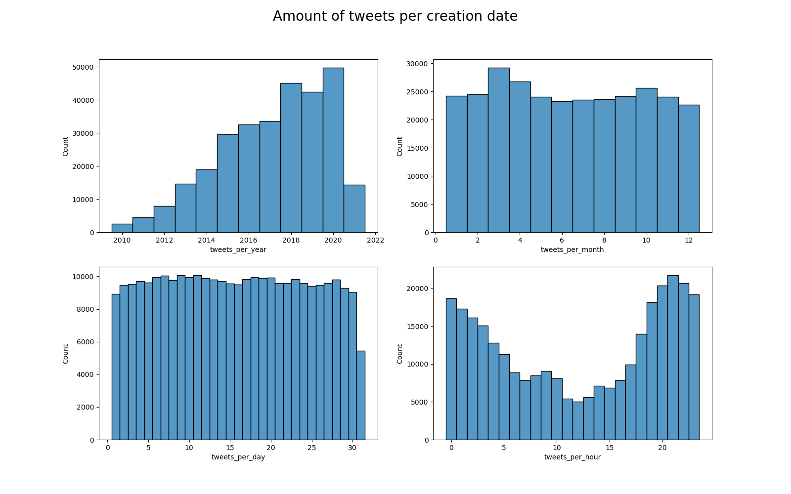
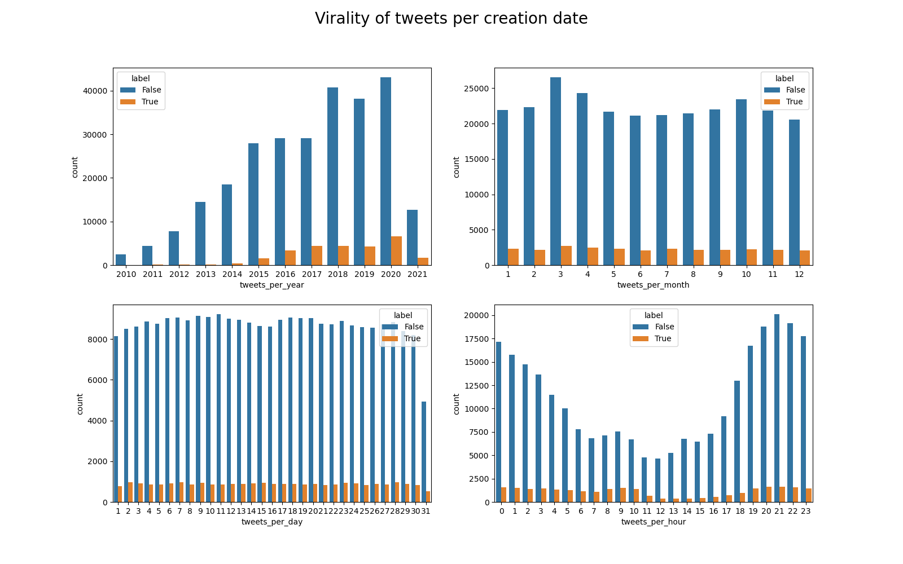

[comment]: <> (![df_description]&#40;images/tweets_amount_per_creation_date.png&#41;)
[comment]: <> (![df_description]&#40;images/tweets_virality_per_creation_date.png&#41;)

### Results and Interpretation

- The means and variances are pretty much alike and higher for features such as `likes_count`, `replies_count` and
`retweets_count` when compared to the other features. However, with respect to the labels feature of interest, it 
  is not the case.
- Similarly, these three features show to have a high correlation among them but not necessarily with respect to the 
label feature.
  
The scatterplot visualizations show that:
- Tweets are likely not viral if likes < 50.
- Tweets are likely not viral if retweets < 47.
- Replies do not explain virality very well, given percentile distributions are flat between true and false labeled tweets.
- Tweets (slightly) tend to be viral when fewer hashtags are used.
- Few retweets are needed to make tweets viral when they are also replied.
- Tweets seem to need fewer likes to go viral when language is English.
- When photos are added, tweets need more likes for them to go viral.
  
To extract and create the `time` and `date` related features, we observed that time zone is consistent and no missing values 
were found. When looking at the `Date` and `Time` features we can see that:
- The most telling and helpful feature to consider seems to be the `tweets_per_hour` since there seems to be a 
considerable change in the amount of tweets made per hour. 
- Additionally, this difference is smaller for the amount of tweets that go viral per hour. Namely, viral tweets are 
fewer between roughly 11:00 and 16:00.

## Feature Extraction

Most of the feature selection process was done based on the results obtained from the visualization, as we explained in the previous section.
###Selected features:
- `month_tweet`, and `feature_hour` are from the Date and Time columns.
- `contain_website`, `contain_photo` and `feature_hashtag`,  consist of the amount of websites, photos and hashtags a tweet contained.
- `tfidf` is a vectorial representation of the tweet.
- `character_length` contains the length of the tweet.

## Dimensionality Reduction

We applied dimensionality reduction to the features described above. 

We wanted to reduce the dimensionality of the data to analyze the behaviour and usefulness of 
specific features during classification. 

### Design Decisions

In order to reduce the data's dimensionality we first standardized the data so that values would be around the same range 
and, thus, preventing the difference between the values to be high. For this, we used the `StandardScaler` function from
`sklearn.preprocessing`. Afterwards, we applied principal component analysis (PCA) to the standardized data 
and reduced the dimensions to 2 `n_components = 2`.

### Results

#### Explained variance ratio:
We found that the principal component 1 holds 31.3% of the information while the second principal 
component holds the 20%. On the other hand, we also found that after projecting  five-dimensional data
to two-dimensional data, 48.7 % of the information was lost.

#### Training split: visualization PCA

 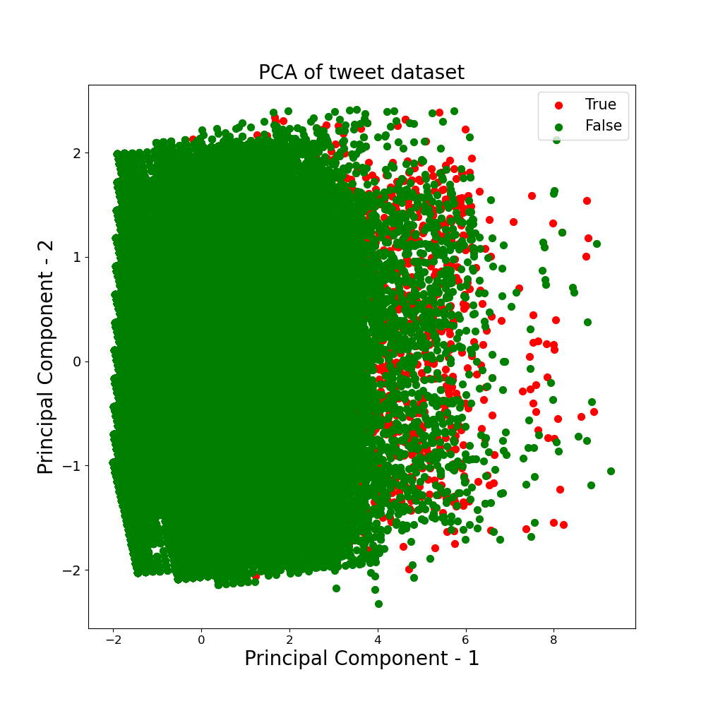
 
As suggested by the graph above, the data cannot be easily separated linearly. Besides, the True class (the tweet is viral) is more spread out than the non-viral
class (False). The results for the validation and test set do no differ much, you can find the plots <a href="https://github.com/yesidc/MLinPractice/tree/main/images">here</a>

## Classification

### Design Decisions

Which classifier(s) did you use? Which hyperparameter(s) (with their respective
candidate values) did you look at? What were your reasons for this?

#### Multinomial Naive Bayes:

We implemented Multinomial Naive Bayes (which implements the Naive Bayes algorithm) since, according to <a href="https://scikit-learn.org/stable/modules/naive_bayes.html">sklearn</a> documentation, besides it being a classic naive Bayes variant used in text classification; it also performes well with tf-idf vectors and it is well suited for NLP problems. (which is one of the features we extracted)

### Training:

We did the training process on the grid. At first we tried to extract all the features described above, but it was not possible due to the fact that the memory was exceeded. We resquested up to 64 GB of memory, but this was not enough. Given this memory restriction, we extracted all features but tfidf, and proceded to train the model. 

### Results:
    will be removed { 
    
The big finale begins: What are the evaluation results you obtained with your
classifiers in the different setups? Do you overfit or underfit? For the best
selected setup: How well does it generalize to the test set?
       
       }

result after running our classifiar with our selected features but, Principal Component Analysis and without TFIDF

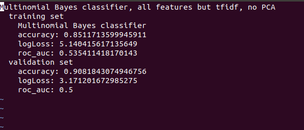

results we get after running Majority class classfiar :

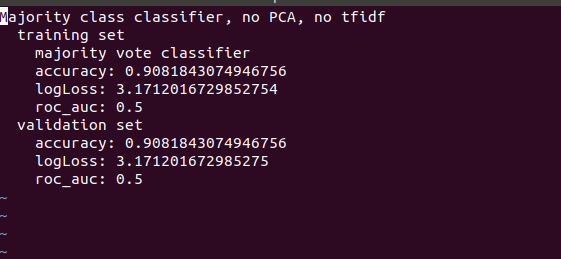

from the results, we can say that our model doesn't tend towards under or over fitting. With our selected features, our model has been performing quite well classifying the possibility of tweets going viral. However, we could not implement TFIDF for the limitation of grid memory. We believe that, with TFIDF, our model can perform even better as this is a very important in terms of NLP.

### Interpretation
      will be removed { 
      
Which hyperparameter settings are how important for the results?
How good are we? Can this be used in practice or are we still too bad?
Anything else we may have learned?

        }

from the results for the training set, we can see that we have a accuracy of 85%. So the classificar is not very efficient in classifying. But the resulted parameters are significant with LogLoss of 5.14 and roc_auc of 0.53. Logloss can be from zero to infinity, which means results closer to zero is efficent and more accurate and gets worse as it moves far from zero. For our classifiar, 5.14 is pretty close to zero, which indicates the model is performing significantly well. In terms of ROC_AUC, the model has 0.53 which is slightly over the threshold(0.5) of being absoulately efficient. So the results can be concluded as beging almost perfectly identified the true positive and true negative values. 

For the valication set, the classifier is better in classifying with higher accuray and roc_aoc of 0.5, which means, the classificar is better in classifying the validation set. 

To implement this classifiar in practice, the classifiar needs to perform better than 85%. The dataset used is very big and enriched for training the model. Hence, due to some technical issue, more impornat features like TFIDF and training the model with multiple features are very compotationaly costly, which are not fully implemented. With those problems overcome, the model could be over 93% in terms of accuracy. However, for learning purpose, the model performs nicely and adds great value for further learning and leaves a scope for improvement.

