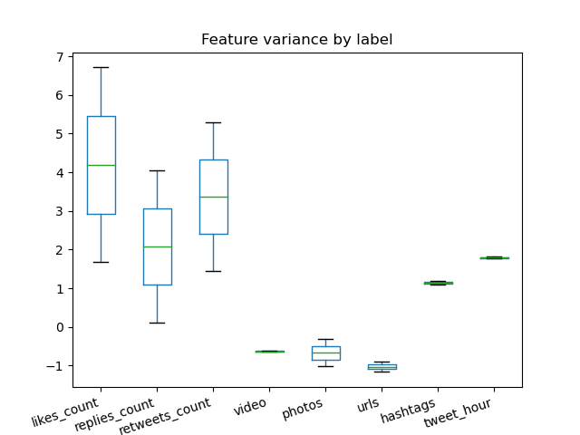
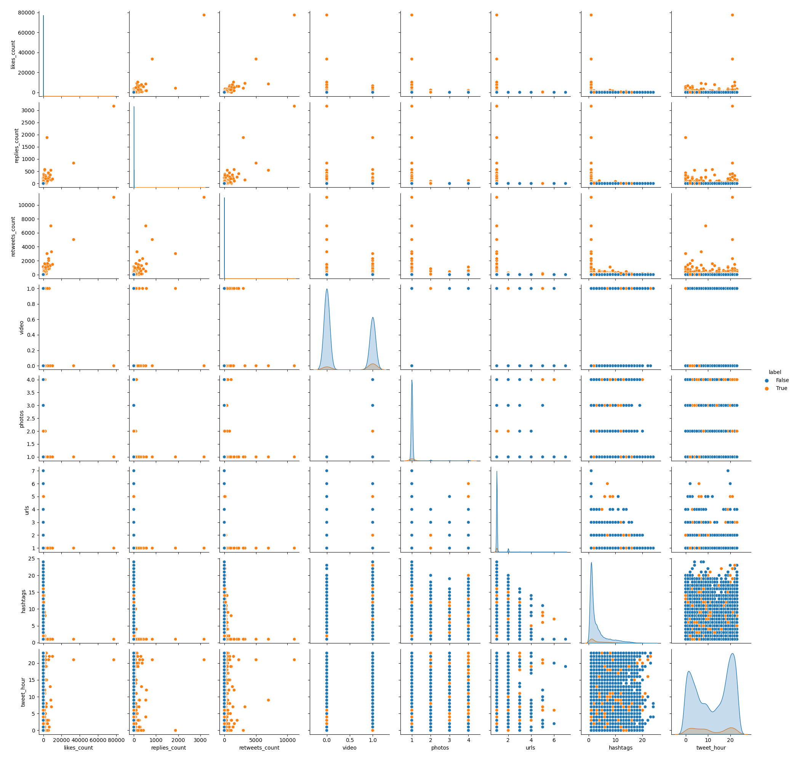

# Documentation for predicting tweets virality using ML

In this project we worked with a data set composed of tweets about data analysis, data science, and data visualization.
The main goal of this project was to analyse the data features and predict tweets virality.
For easy applicability, a console-based application for tweet classification is provided. This allows anyone to type a 
certain tweets into the console and have the model predict whether the tweet will become viral or not.

In the following documentation we provide specifics about the processes involved during the model implementation.

## Evaluation

### Design Decisions

Which evaluation metrics did you use and why? 
Which baselines did you use and why?

### Results

How do the baselines perform with respect to the evaluation metrics?

### Interpretation

Is there anything we can learn from these results?

## Preprocessing

I'm following the "Design Decisions - Results - Interpretation" structure here,
but you can also just use one subheading per preprocessing step to organize
things (depending on what you do, that may be better structured).

### Design Decisions

Which kind of preprocessing steps did you implement? Why are they necessary
and/or useful down the road?

### Results

Maybe show a short example what your preprocessing does.

### Interpretation

Probably, no real interpretation possible, so feel free to leave this section out.

## Feature Visualization
To reduce the computational complexity and focus all the resources in the most valuable and telling 
features, we decided to do some initial look into our `tweets` data to get an idea about how different 
features interact with each other and how they influence tweets virality. This way we could reduce the amount 
of less useful features we have and identify the most explanatory variables thus improving the interpretability 
of the model. Afterwards, we can select those features that are more relevant for virality, and then use them
to train our model to predict tweets virality. 

### Design Decisions
Initially, we did some exploratory analysis of the data features as given by looking at the data description and 
variance.
- Initial data features description and variance

[comment]: <> (![df_description]&#40;images/description_data.png&#41;)

[comment]: <> (![df_variance]&#40;images/features_variance.png&#41;)

Afterwards we selected some features, created some others by counting the amount of hashtags, urls, photos, 
videos and the hour of tweets creation since we consider they could be useful to predict tweets' virality. 
Also, dropped out those features with `NaN` values.

[comment]: <> (![df_description]&#40;images/features_variance_cleaned.png&#41;)

We also grouped the selected features by `label` (viral | non-viral) and calculated their means and variance.

  
  
  
  

[comment]: <> (![df_description]&#40;images/features_means_by_label.png&#41;)

[comment]: <> (![df_description]&#40;images/features_variance_by_label.png&#41;)

[comment]: <> (![df_description]&#40;images/features_means_grouped_by_label.png&#41;)

Finally, we did feature selection by calculating the correlations between the data features. In the
`feature_selection_by_correlation.png` we have the `heatmap` correlation for both the clean and uncleaned 
data which give us a better representation of the features' relationship.

  
  
  

[comment]: <> (![df_description]&#40;images/feature_selection_by_correlation.png&#41;)

With the `df_clean` already grouped by label we proceed to explore tweets' virality by creating different scatterplots 
for all features. 

  
  
  
  

  
  

[comment]: <> (![df_description]&#40;images/retweets_likes.png&#41;)

[comment]: <> (![df_description]&#40;images/hashtags_likes.png&#41; )

[comment]: <> (![df_description]&#40;images/replies_likes.png&#41; )

[comment]: <> (![df_description]&#40;images/replies_retweets.png&#41;)

[comment]: <> (![df_description]&#40;images/language_likes.png&#41; )

[comment]: <> (![df_description]&#40;images/photos_likes.png&#41;)

The `Date` and `Time` features were also relevant for our analysis of tweets virality. Thus, we explored the amount of 
tweets by date (`year`, `month`, and `day`) and time (`hour`) of creation.

[comment]: <> (![df_description]&#40;images/tweets_amount_per_creation_date.png&#41;)

[comment]: <> (![df_description]&#40;images/tweets_virality_per_creation_date.png&#41;)

### Results and Interpretation

The means and variances are pretty much alike and higher for features such as `likes_count`, `replies_count` and
`retweets_count` when compared to the other features. Similarly, these three features show to have a high correlation. 
The scatterplot visualizations show that:
- Tweets are likely not viral if likes < 50.
- Tweets are likely not viral if retweets < 47.
- Replies do not explain virality as well, given percentile distributions are flat between true and false labeled tweets.
- Time zone is consistent and no missing values were found. 

When looking at the `Date` and `Time` features we can see that the most telling and helpful feature to consider would be
the `tweets_per_hour` since there seems to be a considerable change in the amount of tweets made per hour. Additionally, 
this difference is smaller for the amount of tweets that go viral per hour. Namely, viral tweets are less between 
roughly 11:00 and 16:00.

## Feature Extraction

Again, either structure among decision-result-interpretation or based on feature,
up to you.

### Design Decisions

Which features did you implement? What's their motivation and how are they computed?

### Results

Can you say something about how the feature values are distributed? Maybe show some plots?

### Interpretation

Can we already guess which features may be more useful than others?

## Dimensionality Reduction

We applied dimensionality reduction to those features of the data we had previously selected based on the visualizations.
Some features created include:

- `month_tweet`, and `hour_tweet` are from the Date and Time columns.
- `contain_website`, `contain_photo` consists of the amount of websites and photos a tweet contained.
- `tfidf` is a vectorial representation of the tweet.
- `character_length` contains the length of the tweet.

We wanted to reduce the dimensionality of the data to analyze the behaviour and usefulness of 
specific features during classification. 

### Design Decisions

In order to reduce the data's dimensionality we first standardized the data so that values would be around the same range 
and, thus, preventing the difference between the values to be high. For this, we used the `StandardScaler` function from
`sklearn.preprocessing`. Afterwards, we applied principal component analysis (PCA) to the standardized data 
and reduced the dimensions to 2 `n_components = 2`.

### Results

Which features were selected / created? Do you have any scores to report?

### Interpretation

Can we somehow make sense of the dimensionality reduction results?
Which features are the most important ones and why may that be the case?

## Classification

### Design Decisions

Which classifier(s) did you use? Which hyperparameter(s) (with their respective
candidate values) did you look at? What were your reasons for this?

#### Multinomial Naive Bayes:
We implemented Multinomial Naive Bayes (which implements the Naive Bayes algorithm) since, according to <a href="https://scikit-learn.org/stable/modules/naive_bayes.html">sklearn</a> documentation, besides it being a classic naive Bayes variant used in text classification; it also performes well with tf-idf vectors (which is one of the features we extracted)

### Results

The big finale begins: What are the evaluation results you obtained with your
classifiers in the different setups? Do you overfit or underfit? For the best
selected setup: How well does it generalize to the test set?

### Interpretation

Which hyperparameter settings are how important for the results?
How good are we? Can this be used in practice or are we still too bad?
Anything else we may have learned?

